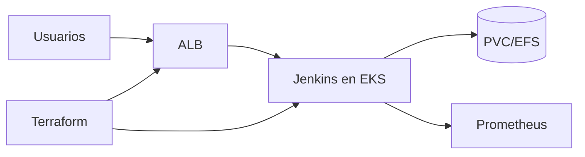

# Presentación — Jenkins en EKS + ALB Ingress

Material listo para publicar en **LinkedIn** (post + carrusel). Copiá cada sección como una diapositiva o bloque del post.

**Speech listo para copiar/pegar:** [speech-linkedin.md](speech-linkedin.md)

---

## Slide 1 — Hook

### Jenkins en EKS con HTTPS y persistencia, sin armar el puzzle a mano

Presento **Jenkins en EKS + ALB Ingress**: Jenkins en EKS con ALB Ingress, PVC, DNS/ACM y métricas Prometheus — Terraform

Terraform · EKS · Jenkins · AWS Load Balancer Controller · ACM · Prometheus

---

## Slide 2 — El dolor

- Ingress + ACM + DNS
- Datos de Jenkins que se pierden al reiniciar
- Métricas y roles IAM a medias

**Automatizar esto no es lujo — es repetibilidad.**

---

## Slide 3 — Qué hace

---

## Slide 4 — Características

- **Jenkins**: Despliegue en EKS listo para CI
- **ALB Ingress**: Exposición HTTPS con ACM
- **Persistencia**: PVC / EFS para datos de Jenkins
- **Observabilidad**: Métricas Prometheus
- **IAM**: Rol admin para operaciones en el cluster

---

## Slide 5 — Cómo probarlo

1. Cloná el repo
2. Copiá `terraform.tfvars.example` → `terraform.tfvars`
3. `terraform init && plan && apply`
4. Revisá outputs / recursos en la consola AWS

Repo: `https://github.com/ghcetraro/terraform_aws_eks_alb_jenkins`

---

## Slide 6 — CTA

Open source · MIT · listo para adaptar a tu cuenta.

⭐ Si te sirve, estrella en GitHub y compartí feedback.

`https://github.com/ghcetraro/terraform_aws_eks_alb_jenkins`
